# VL模型下游案例效果测评

## 0.结论

| 模型名         | Qwen-VL   | Yi-VL     | Deekseek-VL | internVL  | GPT4  |
| -------------- | --------- | --------- | ----------- | --------- | ----- |
| 发布时间       | 2023年9月 | 2024年6月 | 2024年4月   | 2024年6月 | -     |
| 最大参数量     | 7B        | 34B       | 7B          | 40B       | -     |
| 占用显存       | 20GB      | 66GB      | 16GB        | 84GB      | -     |
| 文字识别       | ★★★★★     | ★☆☆☆☆     | ★★☆☆☆       | ★★★★★     | ★★★★★ |
| 公式识别       | ★★★☆☆     | ★★☆☆☆     | ★★★★★       | ★★★★★     | ★★★★★ |
| 医疗影像识别   | ★★★☆☆     | ★★☆☆☆     | ★★★☆☆       | ★★★★☆     | ★★★★★ |
| 表格识别       | ★★★☆☆     | ★☆☆☆☆     | ★★★☆☆       | ★★★★★     | ★★★★★ |
| 论文图像识别   | ★★★★☆     | ★★☆☆☆     | ★★★★☆       | ★★★★★     | ★★★★★ |
| 生活创意类识别 | ★★★☆☆     | ★★★★★     | ★★★★★       | ★★★★★     | ★★★★★ |


## 1.Qwen-VL模型


### 1.0 模型背景

**发布时间**：2023年9月

**发布公司**：通义千问（阿里巴巴）

**参数量**：是在Qwen-7b基础上推展了VL功能，占用空间为20GB，占用显存也为20GB

**简介**：**Qwen-VL** 是阿里云研发的大规模视觉语言模型（Large Vision Language Model, LVLM）。Qwen-VL 可以以图像、文本、检测框作为输入，并以文本和检测框作为输出。Qwen-VL 系列模型性能强大，具备多语言对话、多图交错对话等能力，并支持中文开放域定位和细粒度图像识别与理解。

### 1.1 模型效果

#### 1.1.1 文字识别

##### 案例1

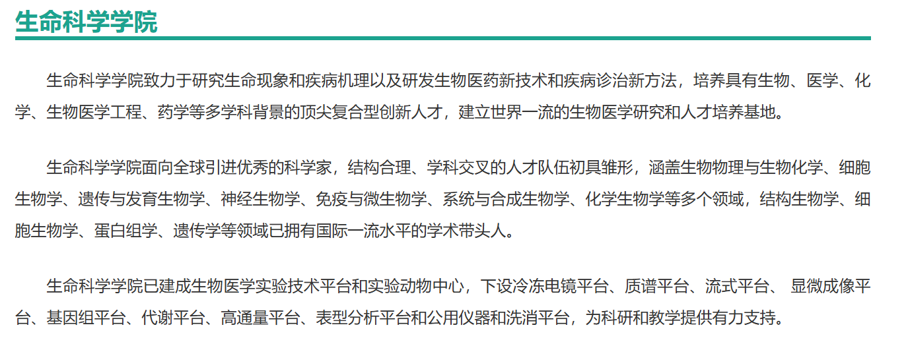

>prompt:请完整地返回这张图片的文本信息

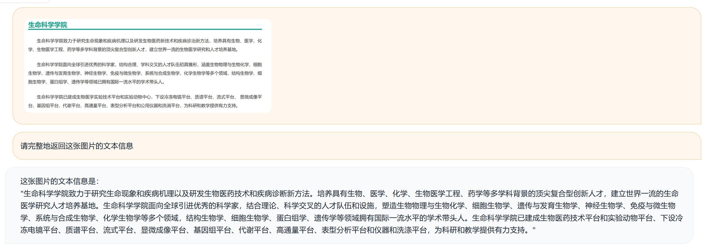

返回内容完全正确

##### 案例2


>prompt:Please return the complete text information of image in full


返回内容完全正确

#### 1.1.2 公式识别

##### 案例1

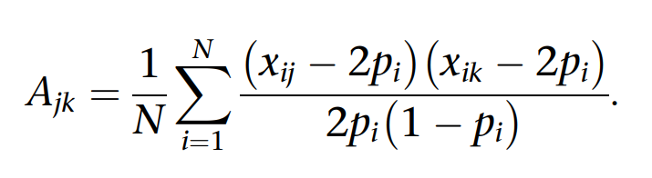

>用latex源码表示上述公式

实际表示效果：

$\frac{1}{N}\sum_{i=1}^{N}(x_{i}-(x_{i})*{\text{mean}})=2p*{1}-2p_{i}$

能识别出部分内容，但完全不正确

##### 案例2


实际表示效果：

$$\begin{aligned} y &= x b + \sum_{i=1}^{n} E_{ii} x + c \ & \end{aligned}$$

整体结构正确，但细节出错很多。

#### 1.1.3 医疗影像图片

##### 案例1(尺骨和桡骨的骨折)

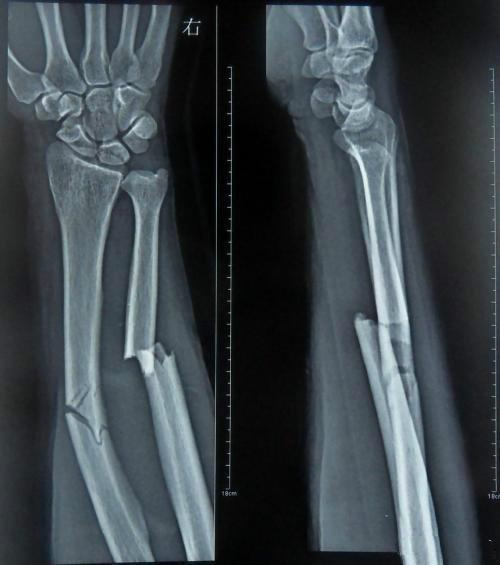

>这张X光片传递了什么信息?

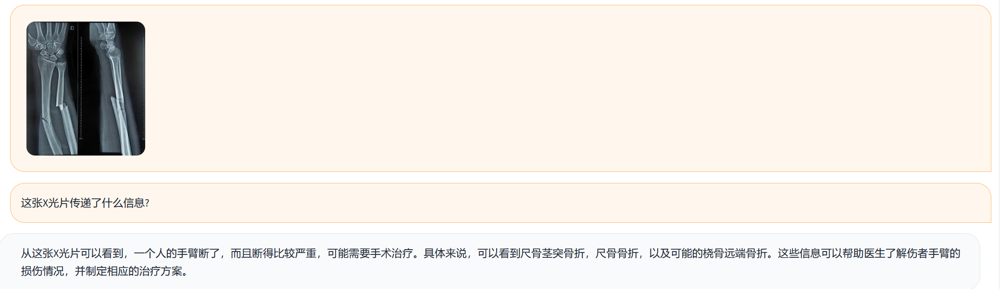

描述基本正确

##### 案例2(肺部空洞)

>空洞是肺实变、肿块或者结节内的充气空隙，呈现透亮区或者低密度区。在肺实变空洞内，肺实变可以消散，只剩下空洞的薄壁。空洞通常是坏死部分通过支气管树排出或者引流后形成。有时候可以有气液平面。空洞不是脓肿的同义词。

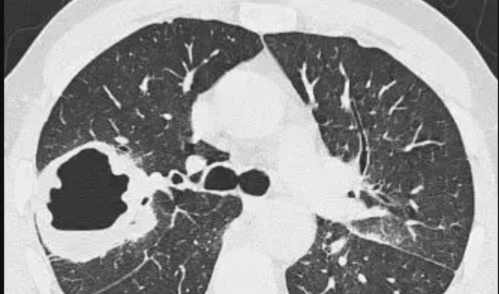

>prompt:What information does this CT scan convey?

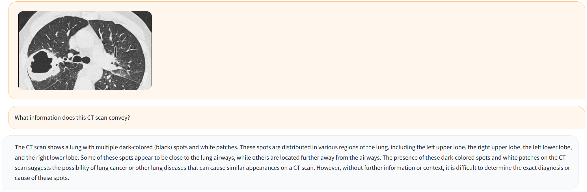

能识别出是肺部，但描述错误很多。

#### 1.1.4 论文图表识别

##### 案例1 


>prompt:这张流程图讲述了什么

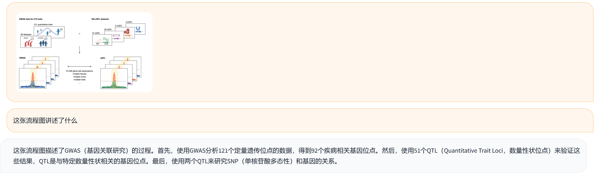

所讲述的问题没问题，但只是流程图的部分内容。

##### 案例2


> prompt:What type of statistical chart is this, and what does it illustrate?


不准确，其实是堆叠图，具体内容也描述得不正确

##### 案例3 


>prompt:用md转化这个表格


基本结构可以解析出来了。

#### 1.1.5 生活类图像

##### 案例1 


>What does this picture depict?


描述正确，但认成复旦大学的李泽祥教授了。

##### 案例2 


>这张图片描述了什么？图片像生物学中的什么？

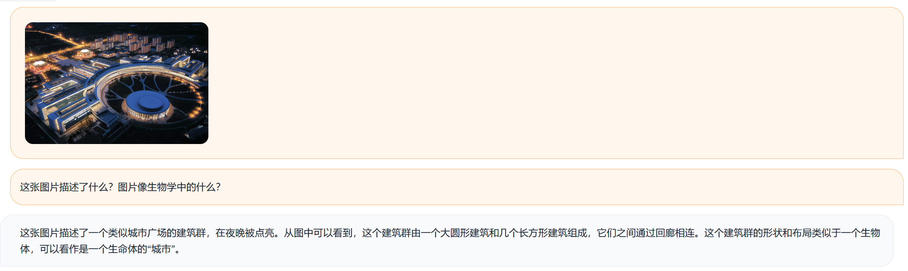

基本正确，但没有超出预期。

### 1.2 总结

占用显存小（约20GB），推理速度快（和Futuregene差不多），在识别文字表格等下游任务中表现很好，在一些简单图像识别中能准确描述出基本信息，但一旦涉及到其他复杂图像的识别时会出现信息缺失，信息识别错误等情况。

## 2.Yi-VL模型

### 2.0 模型背景

**发布时间**：2024年6月25日

**发布公司**：零一万物（去年5月由李开复在各个公司挖人成立）

**参数量**：有6B和34B，下文测试的是34B，占用了约66GB显存

**简介**：Yi视觉语言（Yi-VL）模型是Yi大型语言模型（LLM）系列的开源多模态版本，能够进行内容理解、识别和关于图像的多轮对话。Yi-VL表现出色，在最新的基准测试中（包括英文的MMMU和中文的CMMMU，截至2024年1月的数据），在所有现有开源模型中排名第一。Yi-VL-34B是全球首个开源的34B视觉语言模型。

### 2.1 模型效果

#### 2.1.1 文字识别

##### 案例1


>prompt:请完整地返回这张图片的文本信息


不知所云

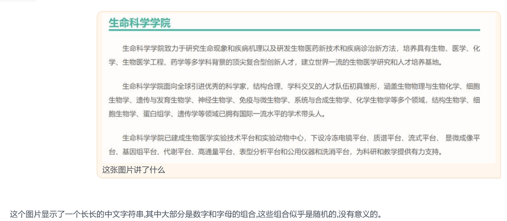

调整prompt再次尝试，很难识别。

##### 案例2


>prompt:Please return the complete text information of image in full


返回内容偏描述性，不能准确提取内容

#### 2.1.2 公式识别

##### 案例1


>用latex源码表示上述公式

实际表示效果：

$A_k = 1 - 2\sin(\pi k)$

能识别出极少内容，但完全不正确

##### 案例2


实际表示效果：

$$y = x_b + \frac{8i}{\sqrt{3}}$$

完全不正确

#### 2.1.3 医疗影像图片

##### 案例1(尺骨和桡骨的骨折)


>这张x光片传递了什么信息？


描述基本正确

##### 案例2(肺部空洞)

>空洞是肺实变、肿块或者结节内的充气空隙，呈现透亮区或者低密度区。在肺实变空洞内，肺实变可以消散，只剩下空洞的薄壁。空洞通常是坏死部分通过支气管树排出或者引流后形成。有时候可以有气液平面。空洞不是脓肿的同义词。


>prompt:What information does this CT scan convey?


识别成大脑了。。。

#### 2.1.4 论文图表识别

##### 案例1 


>prompt:这张流程图讲述了什么


幻觉严重，我认为主要原因是，图片中的文字未能识别出来辅助研究。

##### 案例2


> prompt:What type of statistical chart is this, and what does it illustrate?


能识别出是堆叠图，但由于在文字方面的识别缺陷，整体描述并不准确。

##### 案例3 


>prompt:用md转化这个表格


表格整体识别能力非常差,格式几乎完全错误

#### 2.1.5 生活类图像

##### 案例1 


>What does this picture depict?


描述准确，但过于简单了

##### 案例2 


>这张图片描述了什么？图片像生物学中的什么？

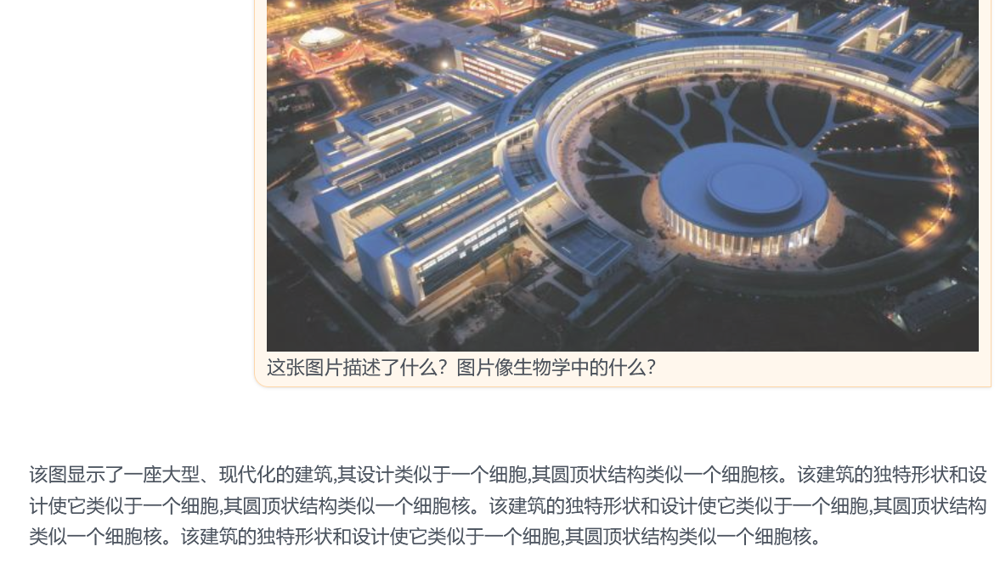

满分，出乎意料！

### 2.2 总结

占用显存大（约66GB），推理速度中等，在识别文字，公式，表格识别等下游任务中表现很差，但一些生活艺术类的图片识别中效果较好，具有创造力。
## 3.Deekseek-VL模型

### 3.0 模型背景

**发布时间**：2024年4月

**发布公司**：杭州深度求索人工智能基础技术研究有限公司(母公司为杭州幻方科技有限公司，量化巨头，屯了1万张卡）

**参数量**：有1.3B和7B，下文测试的是7B，占用了约16GB显存

**简介**：DeepSeek-VL-7b-base 使用 SigLIP-L 和 SAM-B 作为混合视觉编码器，支持 1024 x 1024 图像输入，基于训练了约 2T 文本标记的 DeepSeek-LLM-7b-base 构建。整个 DeepSeek-VL-7b-base 模型最终在大约 400B 视觉-语言标记上进行了训练。DeepSeek-VL-7b-chat 是基于 DeepSeek-VL-7b-base 的指令版本。

### 3.1 模型效果

#### 3.1.1 文字识别

##### 案例1


>prompt:请完整地返回这张图片的文本信息

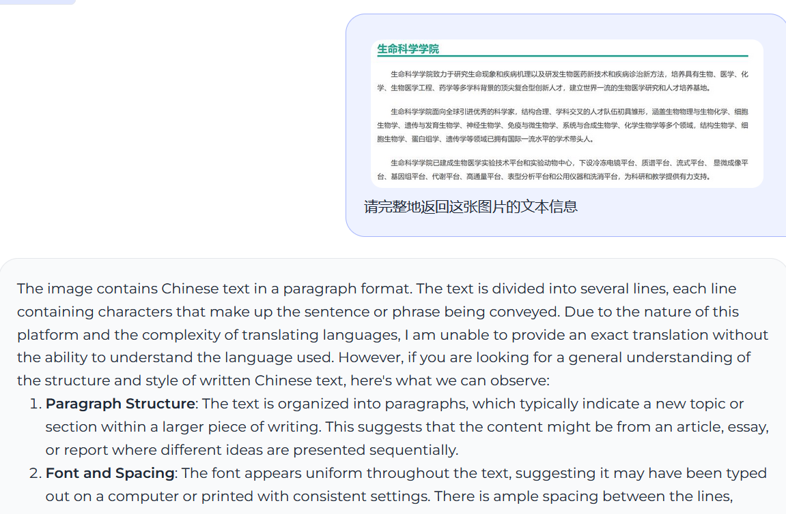

中文文本识别能力差，中文对话能力不足。

##### 案例2


>prompt:Please return the complete text information of image in full


返回内容完全正确

#### 3.1.2 公式识别

##### 案例1


>用latex源码表示上述公式/Use LaTeX source code to represent the above formula.


实际表示效果：

$A_{jk} = \frac{1}{N} \sum_{i=1}^{N} \frac{(x_{ij} - 2 p_i)(x_{ik} - 2 p_i)}{(2 p_i)(1 - p_i)}.$

完美，但用中文prompt提问说不出来

##### 案例2


实际表示效果：

$$\begin{equation}
y = X \beta + \sum_{i=1}^{r} g_i + \epsilon,
\end{equation}$$

完美，但用中文prompt提问说不出来

#### 3.1.3 医疗影像图片

##### 案例1(尺骨和桡骨的骨折)


>这张X光片传递了什么信息?


识别出是左臂，但其实应该是右臂，但没有识别出骨折现象的存在。

##### 案例2(肺部空洞)

>空洞是肺实变、肿块或者结节内的充气空隙，呈现透亮区或者低密度区。在肺实变空洞内，肺实变可以消散，只剩下空洞的薄壁。空洞通常是坏死部分通过支气管树排出或者引流后形成。有时候可以有气液平面。空洞不是脓肿的同义词。


>prompt:What information does this CT scan convey?

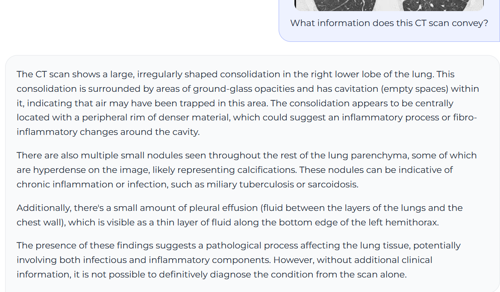

基本正确

#### 3.1.4 论文图表识别

##### 案例1 


>prompt:这张流程图讲述了什么


只能识别出部分内容，`xQTL`识别成`aQTL`,内容部分正确

##### 案例2


> prompt:What type of statistical chart is this, and what does it illustrate?


基本正确，但278的学科并不是`cardiology`是`embryology`,图片的像素太低了，不能怪他。

##### 案例3 


>prompt:用md转化这个表格

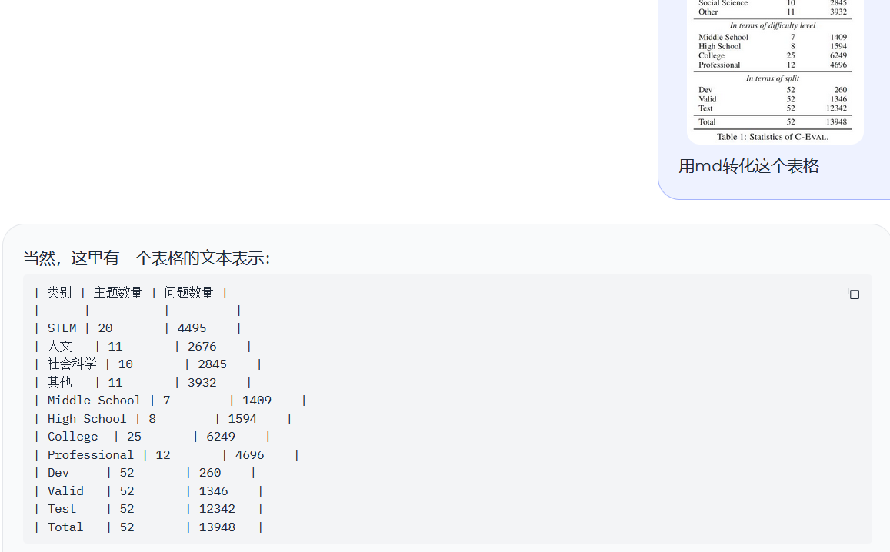

基本正确没有问题

#### 3.1.5 生活类图像

##### 案例1 


>What does this picture depict?

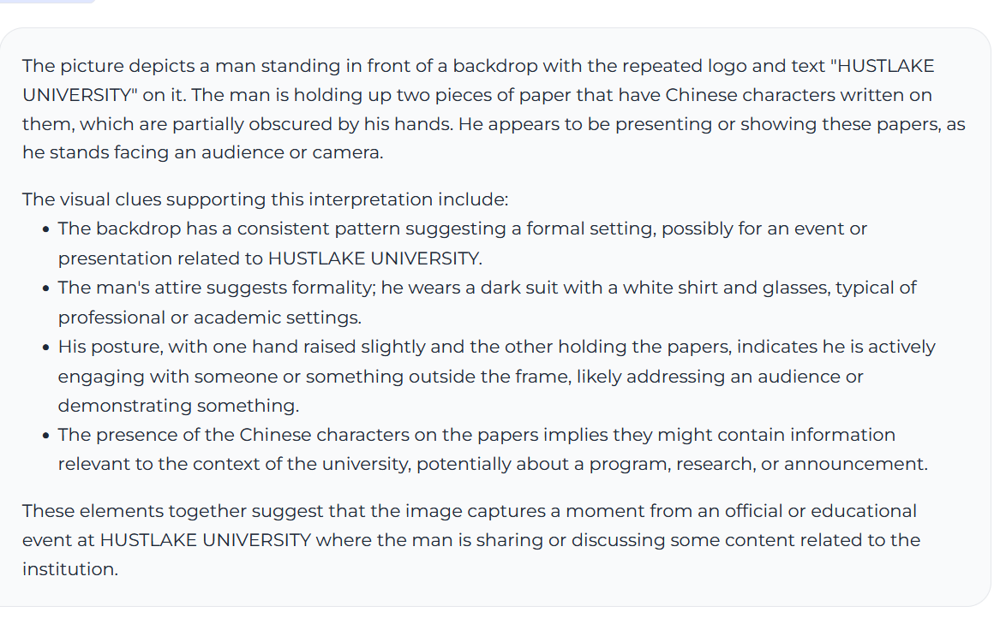

对图像描述细致，但模糊/低分辨文字不能识别准确，中文文字不能有效识别出来。

##### 案例2 


>这张图片描述了什么？图片像生物学中的什么？

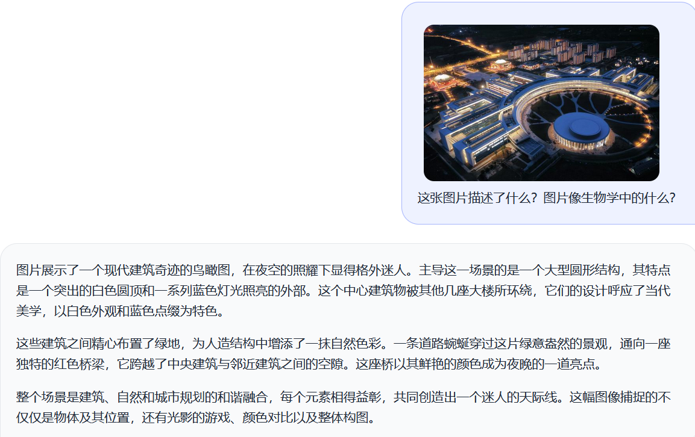


描述细节超出预期。

### 3.2 总结

占用显存小（约16GB），推理速度快（和Futuregene差不多），在识别低分辨率/模糊部分时表现略差，中文文字识别有很大困难，除此之外，几乎完美。
## 4.InternVL

### 4.0 模型背景

**发布时间**：2024年7月9日

**发布公司**：上海人工智能实验室（由上海交通大学、上海市闵行区人民政府、上海临港经济发展（集团）有限公司、上海商汤智能科技有限公司共同组建）

**参数量**：有1、2、4、8、26、40B，下文测试的是40B，占用了约84GB显存

**简介**：与最先进的开源多模态大型语言模型相比，InternVL 2.0 超越了大多数开源模型。在各种能力方面表现出与专有商业模型相当的竞争力，包括文档和图表理解、信息图问答、场景文本理解和 OCR 任务、科学和数学问题解决以及文化理解和集成多模态能力。InternVL 2.0 经过 8k 上下文窗口训练，并利用由长文本、多个图像和视频组成的训练数据，相较于 InternVL 1.5 显著提升了处理这些输入类型的能力。

近日又刚出了基于llamma3-72B的76B模型，但看benchmark差别不大，考虑到上线问题的话增加这么多参数换取这么点progress肯定得不偿失，因此暂时未下降测评。

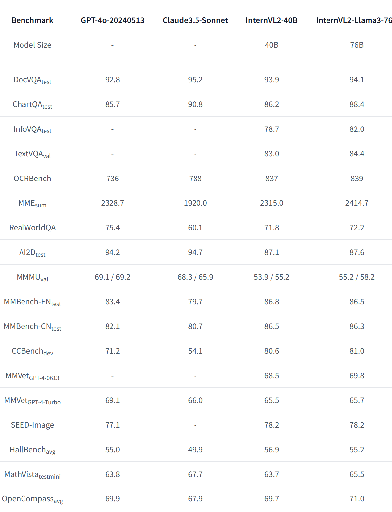


### 4.1 模型效果

#### 4.1.1 文字识别

##### 案例1


>prompt:请完整地返回这张图片的文本信息

```
User: <image>
请完整地返回这张图片的文本信息
Assistant: 生命科学学院

生命科学学院致力于研究生命现象和疾病机理以及研发生物医药新技术和疾病诊疗新方法，培养具有生物、医学、化学、生物医学工程、药学等多学科背景的顶尖复合型创新人才，建立世界一流的生物医学研究和人才培养基地。

生命科学学院面向全球引进优秀的科学家，结构合理、学科交叉的人才队伍初具雏形，涵盖生物物理与生物化学、细胞生物学、遗传与发育生物学、神经生物学、免疫与微生物学、系统与合成生物学、化学生物学等多个领域，结构生物学、细胞生物学、蛋白质组学、遗传学等领域已拥有国际一流水平的学术带头人。

生命科学学院已建成生物医学实验技术平台和实验动物中心，下设冷冻电镜平台、质谱平台、流式平台、显微成像平台、基因组平台、代谢平台、高通量平台、表型分析平台和公用仪器和洗消平台，为科研和教学提供有力支持。
```

返回内容完全正确

##### 案例2


>prompt:Please return the complete text information of image in full

```
User: <image>
Please return the complete text information of image in full
Assistant: Abstract

New NLP benchmarks are urgently needed to align with the rapid development of large language models (LLMs). We present C-EVAL, the first comprehensive Chinese evaluation suite designed to assess advanced knowledge and reasoning abilities of foundation models in a Chinese context. C-EVAL comprises multiple-choice questions across four difficulty levels: middle school, high school, college, and professional. The questions span 52 disciplines, ranging from humanities to science and engineering. C-EVAL is accompanied by C-EVAL HARD, a subset of very challenging subjects in C-EVAL that requires advanced reasoning abilities to solve. We conduct a comprehensive evaluation of the most advanced LLMs on C-EVAL, including both English- and Chinese-oriented models. Results indicate that only GPT-4 could achieve an average accuracy of over 60%, suggesting that there is still significant room for improvement for current LLMs. We anticipate C-EVAL will help analyze important strengths and shortcomings of foundation models, and foster their development and growth for Chinese users. [1]
```

返回内容完全正确

#### 4.1.2 公式识别

##### 案例1


>用latex源码表示上述公式

````
User: <image>
用latex源码表示上述公式
Assistant: ```latex
A_{jk} = \frac{1}{N} \sum_{i=1}^{N} \frac{\left(x_{ij} - 2p_i\right)\left(x_{ik} - 2p_i\right)}{2p_i(1 - p_i)}.
```
````

实际表示效果：

$A_{jk} = \frac{1}{N} \sum_{i=1}^{N} \frac{\left(x_{ij} - 2p_i\right)\left(x_{ik} - 2p_i\right)}{2p_i(1 - p_i)}.$

完美

##### 案例2


````
User: <image>
用latex源码表示上述公式
Assistant: ```latex
\textbf{y} = \textbf{X} \boldsymbol{\beta} + \sum_{i=1}^{r} \textbf{g}_i + \boldsymbol{\varepsilon},
```
````

实际表示效果：

$$\textbf{y} = \textbf{X} \boldsymbol{\beta} + \sum_{i=1}^{r} \textbf{g}_i + \boldsymbol{\varepsilon}, $$

完美

#### 4.1.3 医疗影像图片

##### 案例1(尺骨和桡骨的骨折)


>这张X光片传递了什么信息?

```
User: <image>
这张X光片传递了什么信息?
Assistant: 这张X光片显示了一个人手腕和前臂的骨骼结构。从图像中可以观察到以下几点：

1. **骨骼结构**：图像清晰地展示了手腕和前臂的骨骼，包括桡骨和尺骨。
2. **骨折**：在图像的左侧（患者的右侧），可以看到桡骨和尺骨都有明显的骨折。骨折线清晰可见，表明骨骼已经断裂。
3. **骨折位置**：桡骨的骨折位于靠近手腕的位置，而尺骨的骨折则稍微靠上一些。
4. **骨折类型**：从图像上看，桡骨的骨折似乎是开放性骨折，因为骨折端明显错位。而尺骨的骨折看起来是闭合性骨折，骨折端相对对齐。

这些信息对于医生进行诊断和制定治疗方案非常重要。通常，医生会根据骨折的严重程度和位置来决定是否需要手术、固定或进行其他治疗。
```

描述正确,骨折位置似乎离手腕不是很近

##### 案例2(肺部空洞)

>空洞是肺实变、肿块或者结节内的充气空隙，呈现透亮区或者低密度区。在肺实变空洞内，肺实变可以消散，只剩下空洞的薄壁。空洞通常是坏死部分通过支气管树排出或者引流后形成。有时候可以有气液平面。空洞不是脓肿的同义词。


>prompt:What information does this CT scan convey?

```
User: <image>
What information does this CT scan convey?
Assistant: This CT scan is a cross-sectional image of the chest, showing the lungs, heart, and surrounding structures. Here are some key points conveyed by this scan:

1. **Lung Fields**: The lungs appear to be well-aerated, with no obvious signs of consolidation, masses, or significant abnormalities. The lung fields are clear, indicating no visible fluid accumulation or large masses.

2. **Heart and Great Vessels**: The heart is centrally located, and the major blood vessels (such as the aorta and pulmonary arteries) are visible. The heart size appears normal, and there are no obvious signs of cardiomegaly (enlarged heart).

3. **Pleura**: The pleura, which is the thin membrane surrounding the lungs, appears intact without any signs of pleural effusion (fluid accumulation).

4. **Bones**: The ribs and vertebrae are visible and appear normal, without any signs of fractures or lesions.

5. **Mediastinum**: The mediastinum, which is the central compartment of the thorax containing the heart, trachea, esophagus, and major blood vessels, appears normal.

6. **Bronchi and Bronchioles**: The airways, including the trachea and bronchi, are visible and appear patent without any obvious obstructions or abnormalities.

7. **Pulmonary Nodules**: There is a notable pulmonary nodule in the left lung. This is a small, round, and well-defined lesion. The characteristics of the nodule (such as its size, density, and borders) are important for determining its nature.

8. **Pulmonary Arteries and Veins**: The pulmonary vasculature appears normal, with no signs of vascular congestion or abnormalities.

In summary, this CT scan provides a detailed view of the thoracic structures, showing clear lung fields, a normal heart and mediastinum, and a notable pulmonary nodule in the left lung. Further evaluation and correlation with clinical findings are necessary to determine the significance of the nodule.
```

能识别出是肺部CT，但这是病理照片，并不是健康照片

#### 4.1.4 论文图表识别

##### 案例1 


>prompt:这张流程图讲述了什么

```
User: <image>
这张流程图讲述了什么
Assistant: 这张流程图描述了从全基因组关联研究（GWAS）数据到基因-性状关联（xQTL）分析的过程。

1. **GWAS数据**：
   - 包含213个表型（121个定量表型和92个疾病）。
   - 通过GWAS分析，识别出与这些表型相关的SNP（单核苷酸多态性）。

2. **xQTL数据**：
   - 包含106个xQTL数据库，包括51个eQTL（表达数量性状位点）、50个sQTL（表观数量性状位点）、2个mQTL（代谢数量性状位点）和3个pQTL（蛋白质数量性状位点）。
   - 这些数据库记录了SNP与基因表达、表观遗传修饰、代谢产物和蛋白质水平之间的关系。

3. **整合分析**：
   - 将GWAS数据和xQTL数据结合起来，通过整合分析，识别出61,092个基因-表型关联。
   - 这些关联涉及多个组织、多个组学数据和多个表型。

4. **结果展示**：
   - 通过图表展示了基因-表型关联的分布情况，不同颜色的点代表不同类型的关联。
   - 这些关联在多个组织、多个组学数据和多个表型中都有体现，展示了基因在不同层次上的复杂调控机制。

总结来说，这张流程图展示了从GWAS数据出发，通过整合xQTL数据，最终得到大量基因-表型关联的过程，揭示了基因在不同层次上的调控机制。
```

非常准确！！！

##### 案例2


> prompt:What type of statistical chart is this, and what does it illustrate?

```
User: <image>
What type of statistical chart is this, and what does it illustrate?
Assistant: This is a bar chart that illustrates the number of publications in various biology and medicine subjects.
```

基本正确

##### 案例3 


>prompt:用md转化这个表格

```
User: <image>
用md转化这个表格
Assistant: ```markdown
| Category                | # Subjects | # Questions |
|-------------------------|------------|-------------|
| In terms of topic        |            |             |
| STEM                    | 20         | 4495        |
| Humanities              | 11         | 2676        |
| Social Science          | 10         | 2845        |
| Other                   | 11         | 3932        |
| In terms of difficulty level |            |             |
| Middle School           | 7          | 1409        |
| High School             | 8          | 1594        |
| College                 | 25         | 6249        |
| Professional            | 12         | 4696        |
| In terms of split        |            |             |
| Dev                     | 52         | 260         |
| Valid                   | 52         | 1346        |
| Test                    | 52         | 12342       |
| Total                   | 52         | 13948       |

Table 1: Statistics of C-EVAL.
```

非常精确

#### 4.1.5 生活类图像

##### 案例1 


>What does this picture depict?

```
User: <image>
What does this picture depict?
Assistant: The picture depicts a man standing in front of a backdrop with the repeated text "WESTLAKE UNIVERSITY." He is holding a sign with Chinese characters that read "独立思考," which translates to "independent thinking" in English. The man is dressed in a formal suit and appears to be in a professional setting, possibly giving a presentation or participating in an educational event. The backdrop and the sign suggest that the event is related to Westlake University and the theme of independent thinking.
```

非常详细准确，西湖大学的模糊字体也识别出来了

##### 案例2 


>这张图片描述了什么？图片像生物学中的什么？


```
User: <image>
这张图片描述了什么？图片像生物学中的什么？
Assistant: 这张图片展示了一座现代化的校园或教育机构的鸟瞰图。图片中可以看到多个建筑物，包括教学楼、宿舍楼和一些具有独特设计的建筑。这些建筑被精心规划，形成了一个有序的校园布局。

图片中的建筑布局和设计让人联想到生物学中的细胞结构。具体来说，图片中的建筑群和道路布局类似于一个细胞的结构，尤其是细胞核和细胞质。

1. **中央圆形建筑**：中央的圆形建筑可以看作是细胞核，细胞核是细胞的控制中心，包含遗传物质。
2. **周围建筑**：周围的建筑和道路可以看作是细胞质，细胞质是细胞内除细胞核外的其他部分，包含各种细胞器和物质。
3. **道路和绿化**：道路和绿化带可以看作是细胞内的微管和细胞骨架，它们负责细胞内物质的运输和支撑。

这种类比展示了建筑设计与生物学结构的相似性，体现了人类在设计和规划中的智慧和灵感。
```

联想到细胞满分！

### 4.2 总结

占用显存大（84GB），非常完美，除了在医学影像照片识别上略微逊色，其他功能可以媲美GPT-4。
## 5.GPT4 （web）

### 5.0 模型背景

略

### 5.1 模型效果

#### 5.1.1 文字识别

##### 案例1


>prompt:请完整地返回这张图片的文本信息

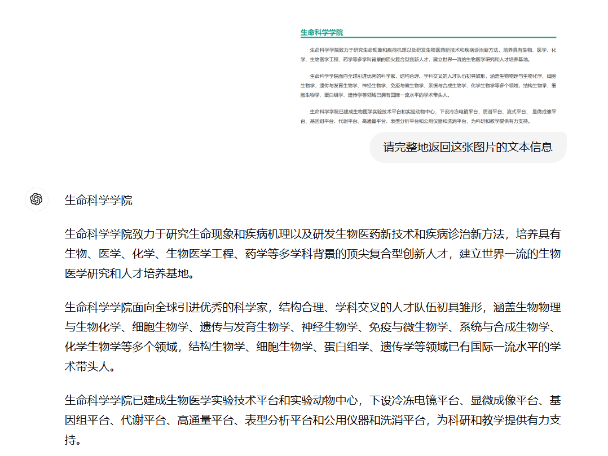

返回内容完全正确，包括分段，完美

##### 案例2


>prompt:Please return the complete text information of image in full

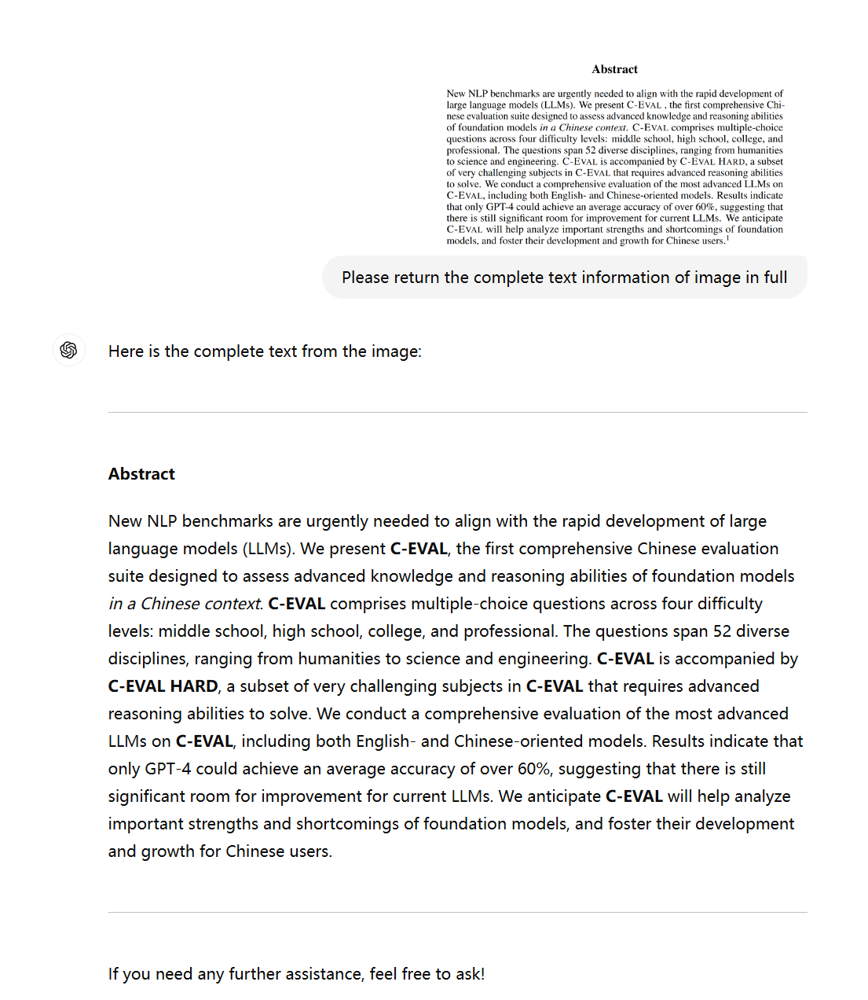

非常细节，加粗字体都能识别出来

#### 5.1.2 公式识别

##### 案例1


>用latex源码表示上述公式

实际表示效果：

$A_{jk} = \frac{1}{N} \sum_{i=1}^{N} \frac{(x_{ij} - 2p_{i})(x_{ik} - 2p_{i})}{2p_{i}(1 - p_{i})}$

完美

##### 案例2


实际表示效果：

$$\mathbf{y} = \mathbf{X}\boldsymbol{\beta} + \sum_{i=1}^{r} \mathbf{g}_i + \boldsymbol{\varepsilon}$$

完美

#### 5.1.3 医疗影像图片

##### 案例1(尺骨和桡骨的骨折)


>这张X光片传递了什么信息?


非常细节，非常正确

##### 案例2(肺部空洞)

>空洞是肺实变、肿块或者结节内的充气空隙，呈现透亮区或者低密度区。在肺实变空洞内，肺实变可以消散，只剩下空洞的薄壁。空洞通常是坏死部分通过支气管树排出或者引流后形成。有时候可以有气液平面。空洞不是脓肿的同义词。


>prompt:What information does this CT scan convey?


详细，准确

#### 5.1.4 论文图表识别

##### 案例1 


>prompt:这张流程图讲述了什么

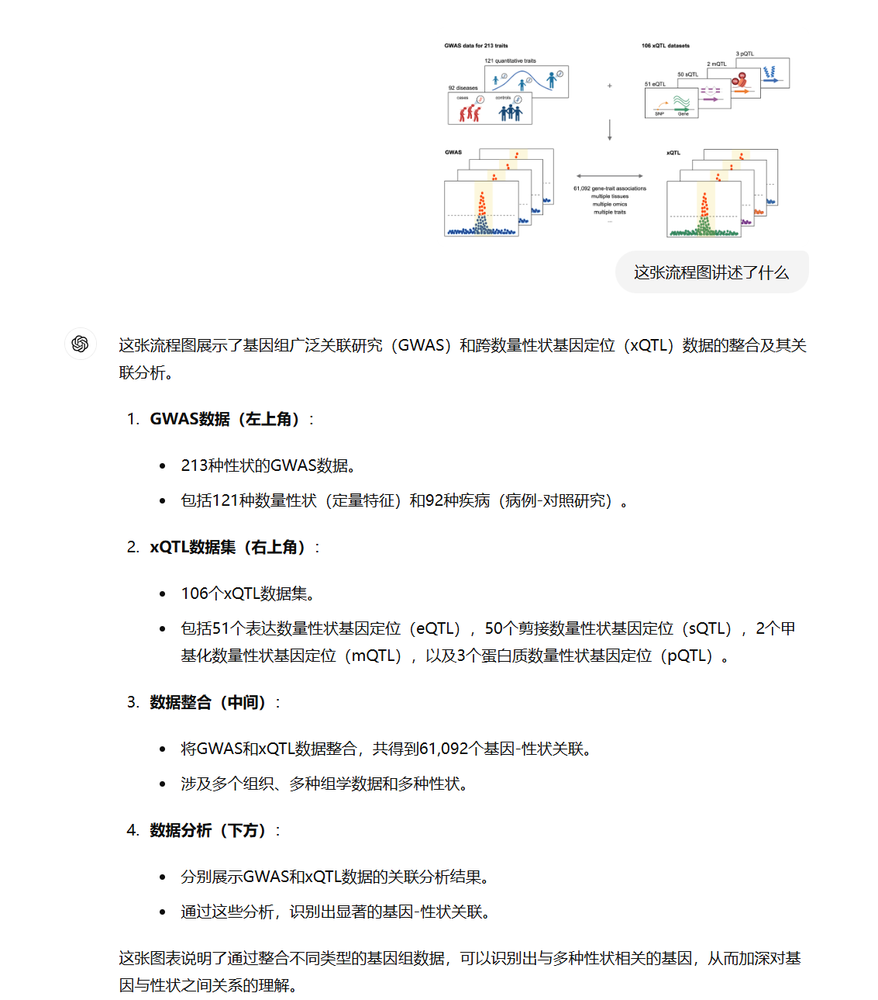

详细、准确。但整体性稍有不足

##### 案例2


> prompt:What type of statistical chart is this, and what does it illustrate?


完全正确

##### 案例3 


>prompt:用md转化这个表格


准确

#### 5.1.5 生活类图像

##### 案例1 


>What does this picture depict?


聚焦的背景也能识别出来，也没有出现幻觉情况。

##### 案例2 


>这张图片描述了什么？图片像生物学中的什么？


太强了，意会到了这是细胞结构！

### 5.2 总结

快准狠的行业标杆

## 6.华佗GPT（web）

### 6.0 模型背景

**发布时间**：2023年11月

**发布公司**：香港中文大学（深圳）和深圳市大数据研究院

**参数量**：基于这些模型微调

**简介**：HuatuoGPT2采用创新的领域适应方法，显著提升其医学知识和对话能力。 在多个医学基准测试中表现出色，尤其是在专家评估和最新的医学执照考试中超越了GPT-4。

### 6.1 模型效果

#### 6.1.1 文字识别

##### 案例1


>prompt:请完整地返回这张图片的文本信息

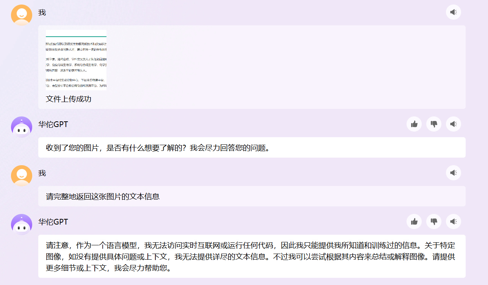

**instruct能力差，进行重复实验**：


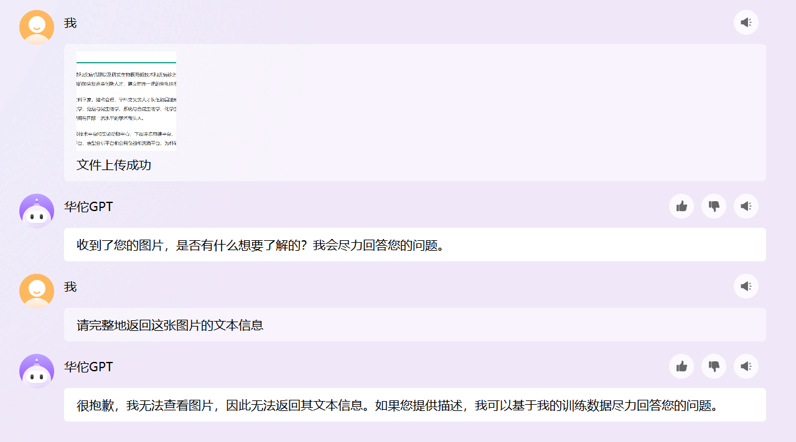

无法识别文字

##### 案例2


>prompt:Please return the complete text information of image in full

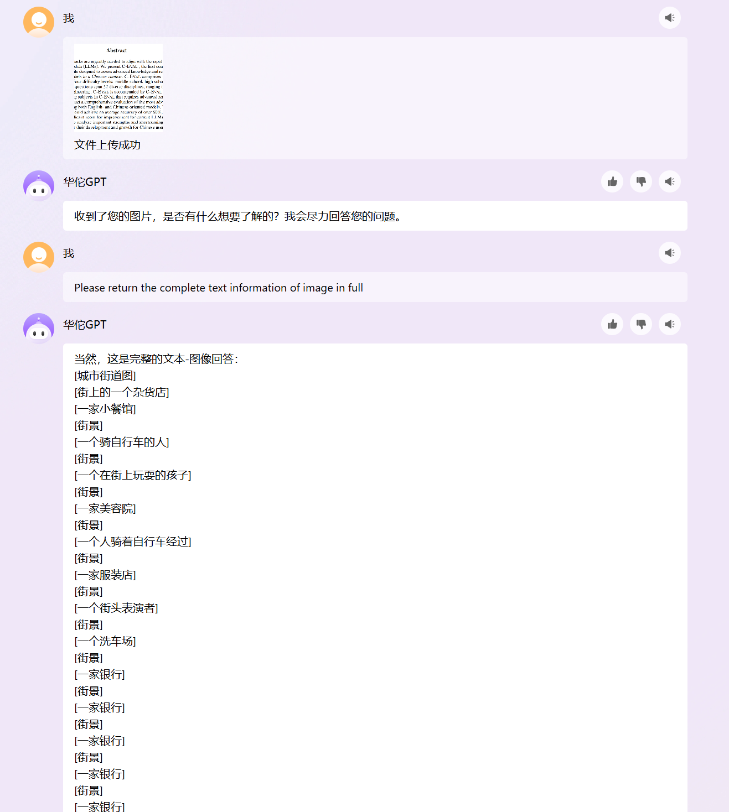

不知所云。。。。英文都不能对齐

#### 6.1.2 公式识别

##### 案例1


>用latex源码表示上述公式

实际表示效果：
$$
\text{Accuracy} = \frac{{\text{TP} \times \text{precision}}}{{\text{TP} \times \text{precision} + \text{FP} \times \left(1-\text{recall}\right)}}
$$
？？？看得出大体结构还是有点相似的

##### 案例2


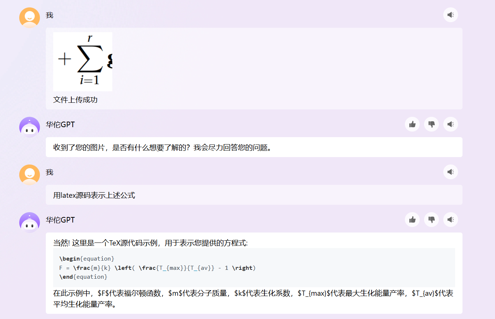

实际表示效果：
$$
\begin{equation}
F = \frac{m}{k} \left( \frac{T_{max}}{T_{av}} - 1 \right)
\end{equation}
$$


完全错误，幻觉严重

#### 6.1.3 医疗影像图片

##### 案例1(尺骨和桡骨的骨折)


>这张X光片传递了什么信息?


？？？fake？

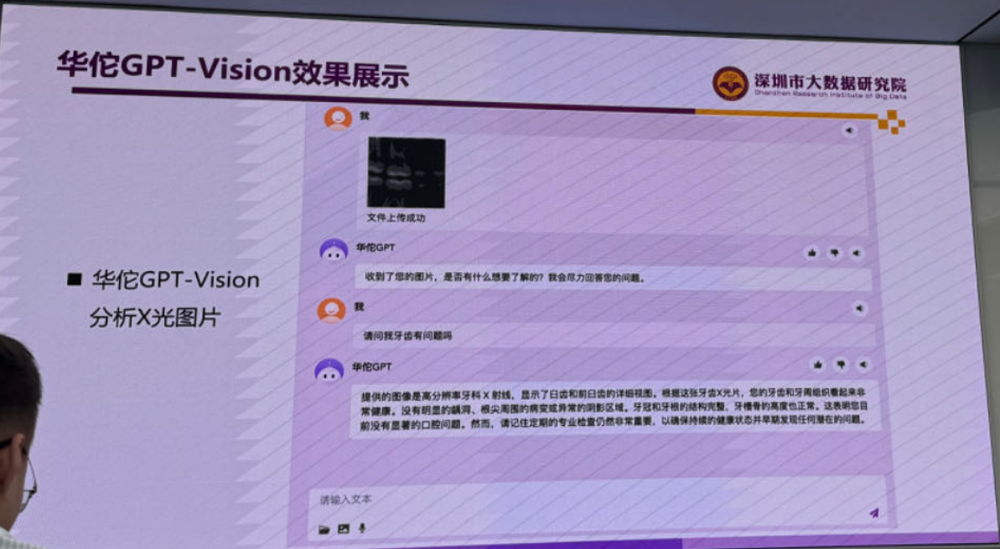

更换prompt：

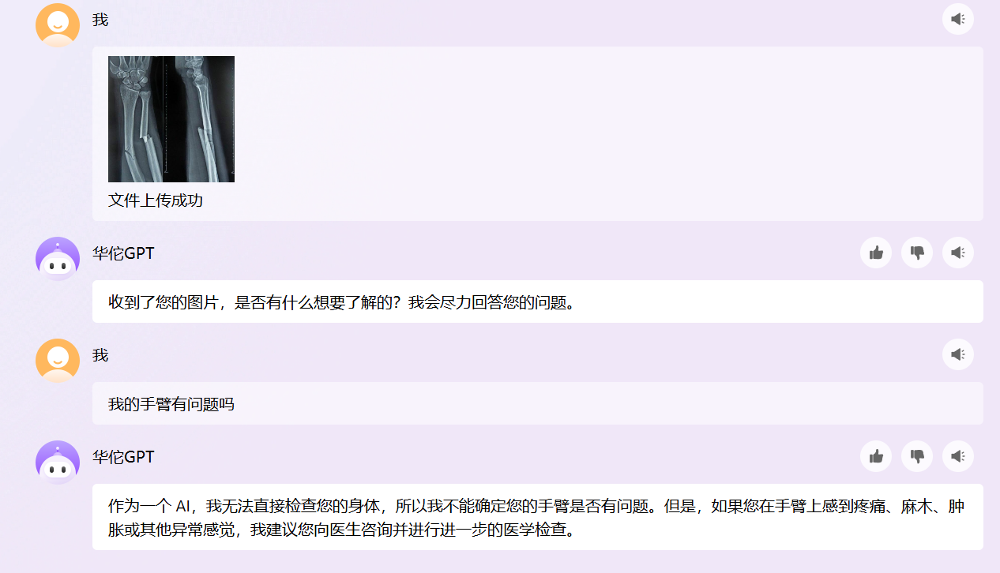

##### 案例2(肺部空洞)

>空洞是肺实变、肿块或者结节内的充气空隙，呈现透亮区或者低密度区。在肺实变空洞内，肺实变可以消散，只剩下空洞的薄壁。空洞通常是坏死部分通过支气管树排出或者引流后形成。有时候可以有气液平面。空洞不是脓肿的同义词。


>prompt:What information does this CT scan convey?

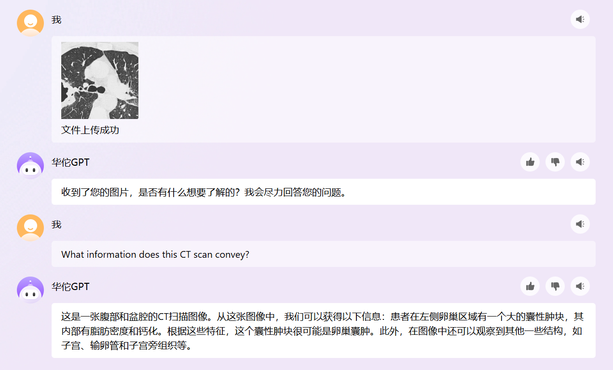

似乎又是能识别出图片的，但这是腹部，完全不准确

#### 6.1.4 论文图表识别

##### 案例1 


>prompt:这张流程图讲述了什么

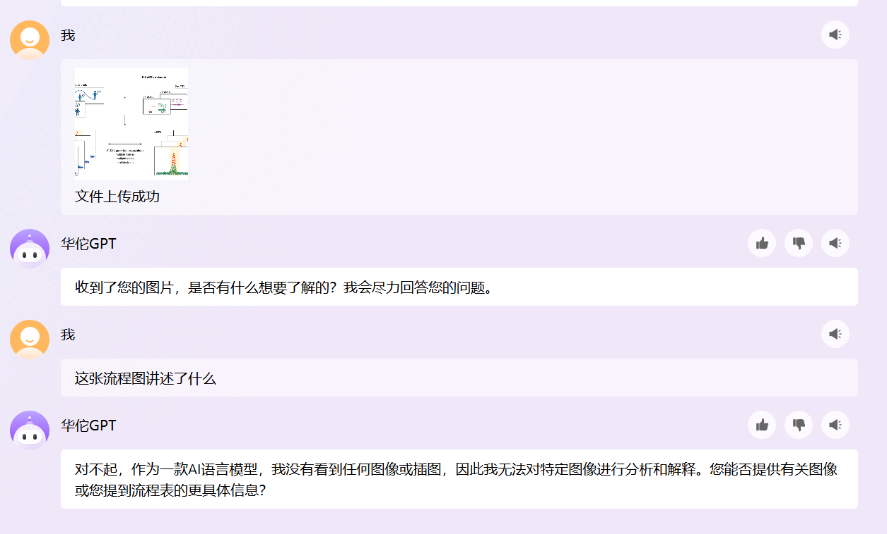

服了，修改prompt：


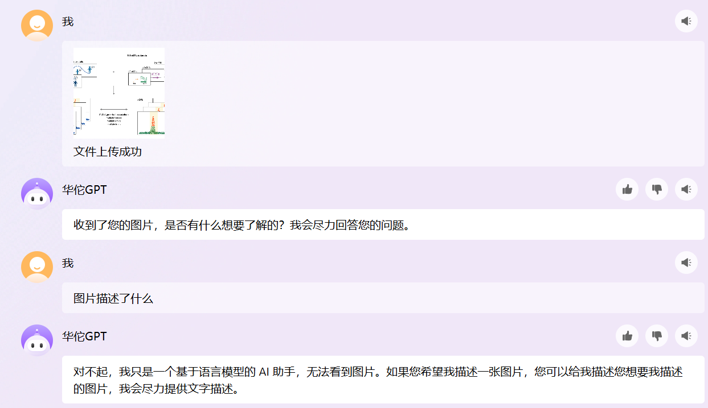


严重怀疑图片功能的真实性

##### 案例2


> prompt:What type of statistical chart is this, and what does it illustrate?

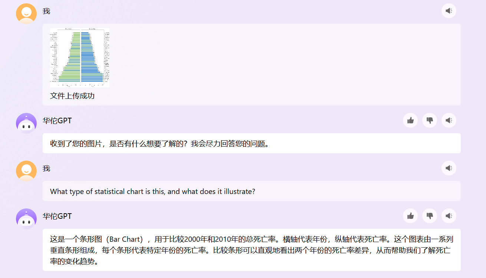

似乎用英文作为prompt，才能理解对图片的请求，但输出总是中文，识别效果很差

##### 案例3 


>prompt:这张表格传递了什么信息？

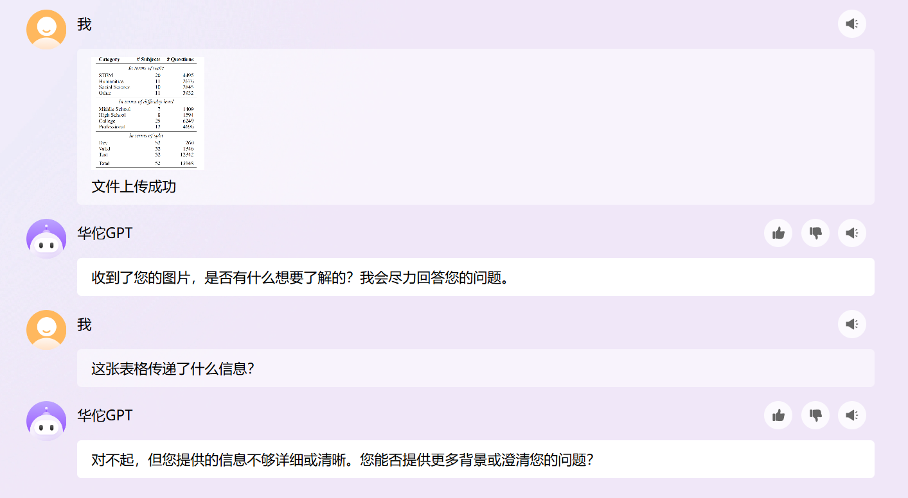


无法识别

#### 6.1.5 生活类图像

##### 案例1 


>What does this picture depict?

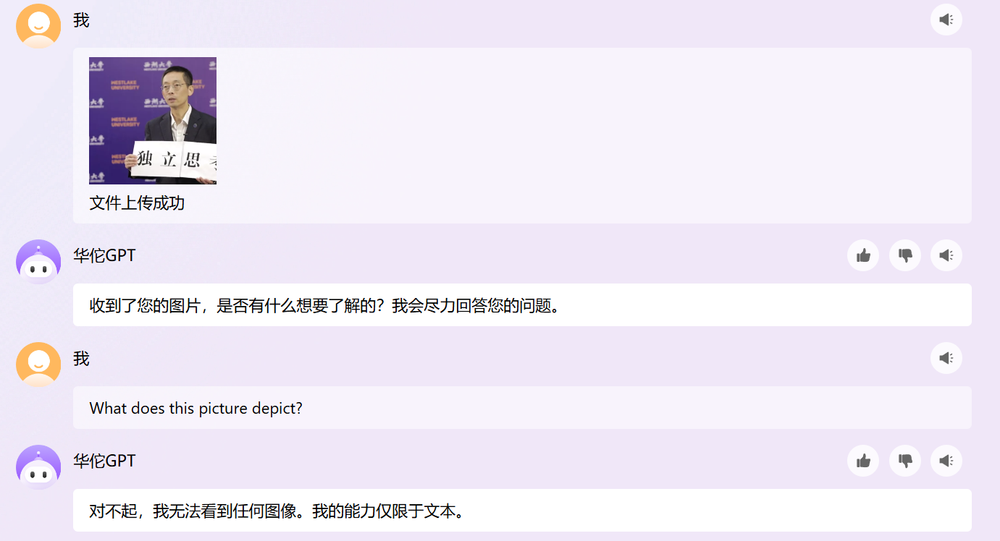

无法识别

##### 案例2 


>这张图片描述了什么？图片像生物学中的什么？

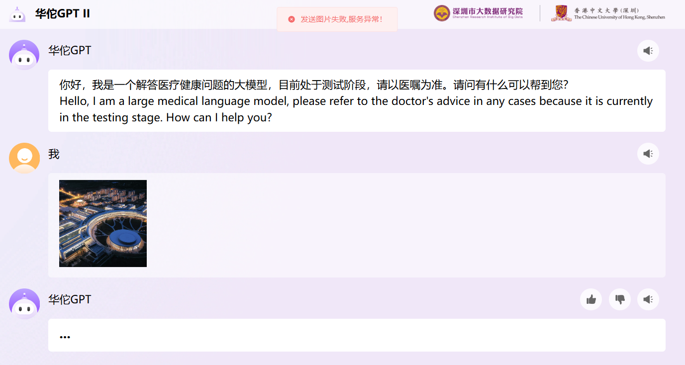

图片大于1M时发送不了。。

### 6.2 总结

绝大多数案例，让我感觉没有图像识别这个功能，这个图片功能大概是没有上线？少数案例可能是模型根据prompt产生的幻觉。
